# Flowchart Sistem — SIDIGAS (Sistem Distribusi Gaji Sopir)

## Simbol — Activity Diagram

| Simbol | Nama | Keterangan |
|--------|------|------------|
| ![start] | **Terminal** (Start/Stop) | Permulaan atau akhir suatu proses |
| ![process] | **Proses** (Action) | Activity/tindakan yang dilakukan |
| ![decision] | **Decision** (Percabangan) | Kondisi yang menghasilkan beberapa kemungkinan (Ya/Tidak) |
| ![swimlane] | **Swimlane** (Actor) | Pemisah aktor/user yang melakukan aktivitas |
| ![flow] | **Flow** (Arus) | Aliran proses dari satu aktivitas ke aktivitas lain |
| ![loop] | **Loop** (Perulangan) | Proses berulang selama kondisi terpenuhi |

> **Catatan:** Simbol di atas mengacu pada standar **Activity Diagram UML** yang digunakan dalam seluruh diagram sistem ini.
>
> Diagram ditulis dalam format **PlantUML** — buka file `.puml` di `docs/` atau render dengan [PlantUML Online Server](https://www.plantuml.com/plantuml/uml/).

---

## Arsitektur Sistem

```
┌─────────────────────────────────────────────────────────────┐
│                    SIDIGAS — Laravel 13                      │
├─────────────────────────────────────────────────────────────┤
│  Frontend: Blade + Tailwind CSS + Vite                      │
│  Backend:  PHP 8.3, Laravel 13.x                            │
│  DB:       MySQL (via migrations)                           │
│  Auth:     Email/Password + Google OAuth (Socialite)        │
│  PDF:      barryvdh/laravel-dompdf                          │
│  Excel:    phpoffice/phpspreadsheet                         │
│  Queue:    Laravel Queue (sync driver)                      │
├─────────────────────────────────────────────────────────────┤
│  9 Models → 10 Controllers → 13 Services → 29 Views          │
└─────────────────────────────────────────────────────────────┘
```

---

## Database Schema

### Entity Relationship Diagram

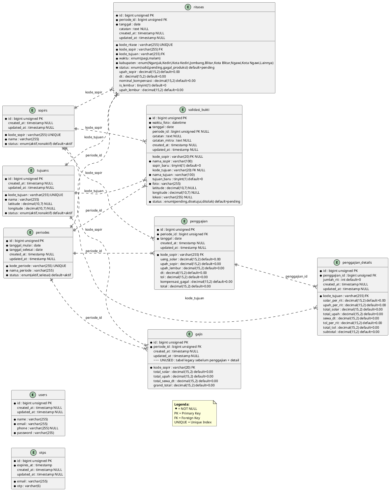

---

## 1. Login (Email & Password)

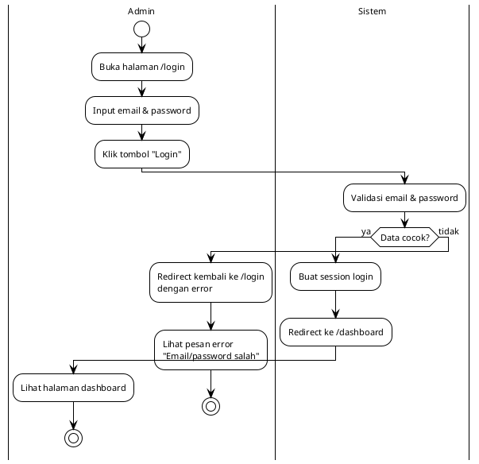

---

## 2. Login Google

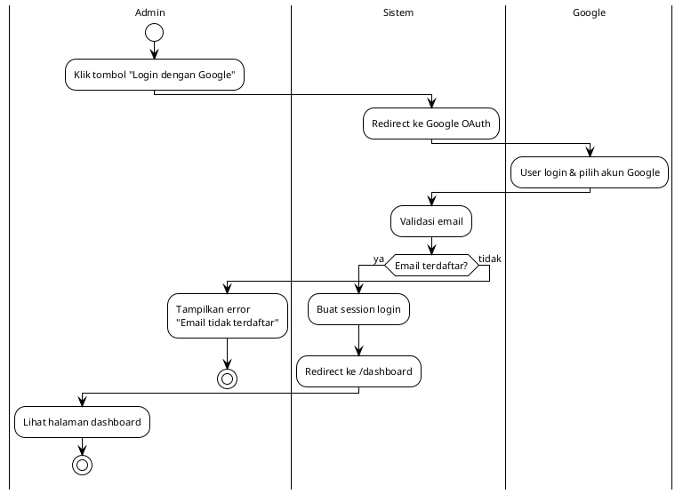

---

## 3. Lupa Password — OTP

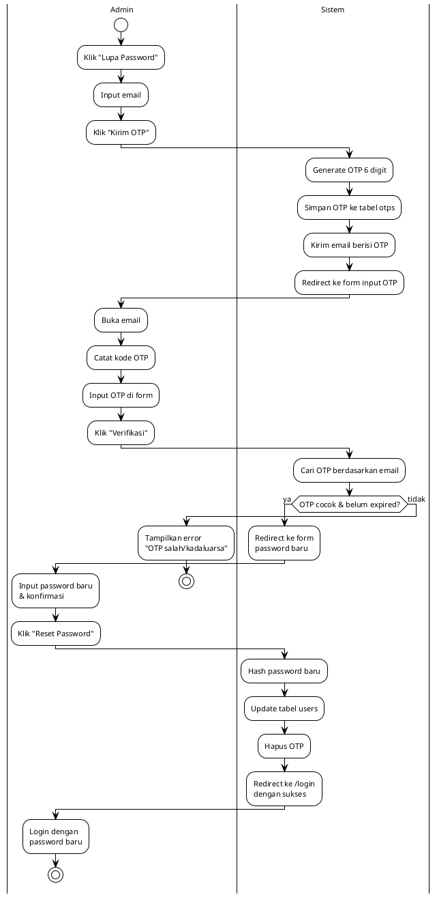

---

## 4. Dashboard

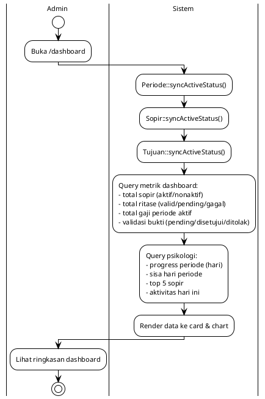

---

## 5. Kelola Sopir (CRUD)


---

## 6. Kelola Tujuan (CRUD)

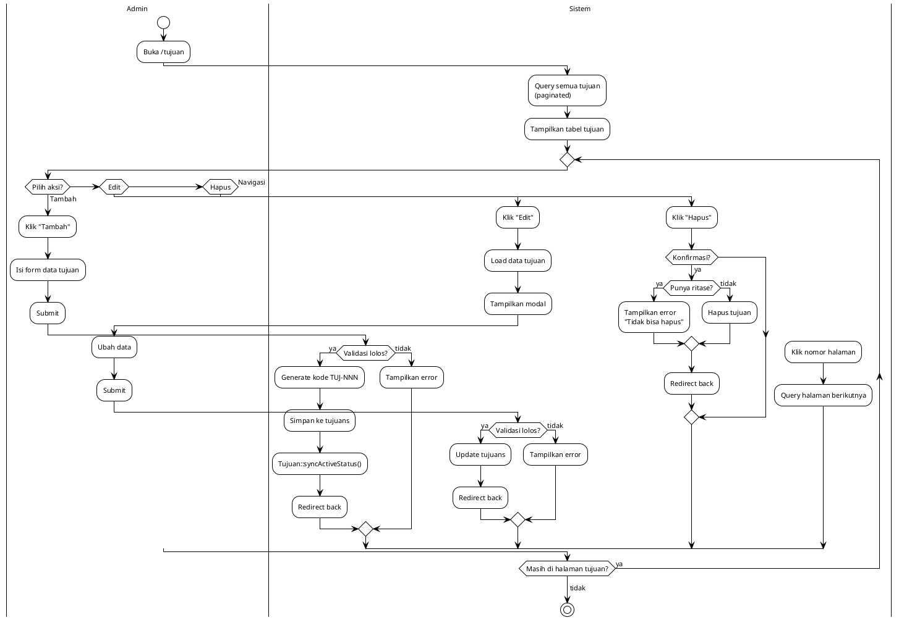

---

## 7. Kelola Periode (CRUD)

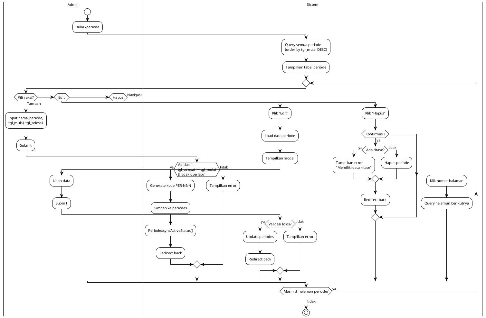

### Auto-sync Status

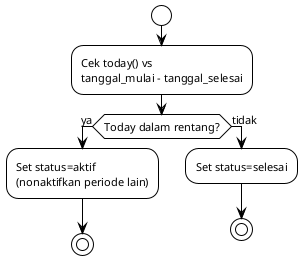

---

## 8. Input Ritase — Parser Teks

### Flowchart Utama

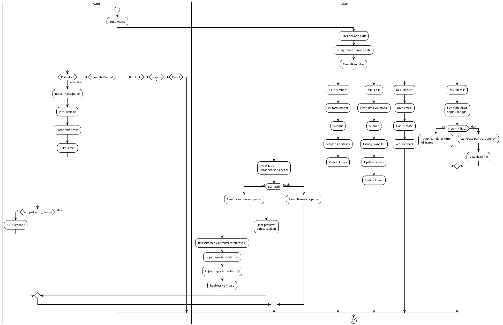

### 8.1. Mekanisme Parsing (REGEX)

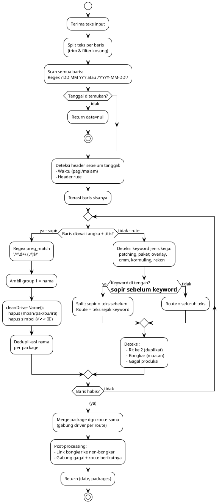

### 8.2. Pencocokan Driver (Fuzzy Matching)

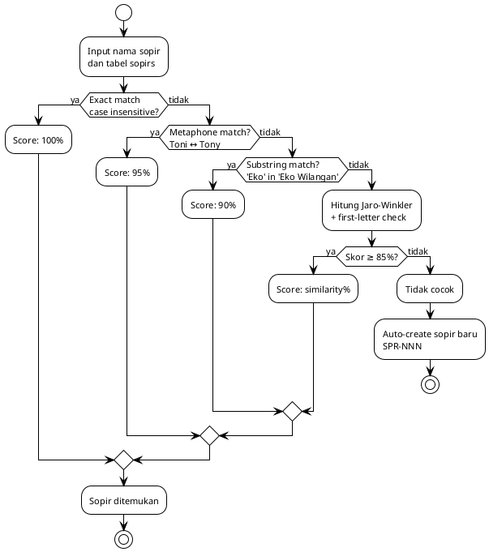

### 8.3. Pencocokan Rute (String Similarity)

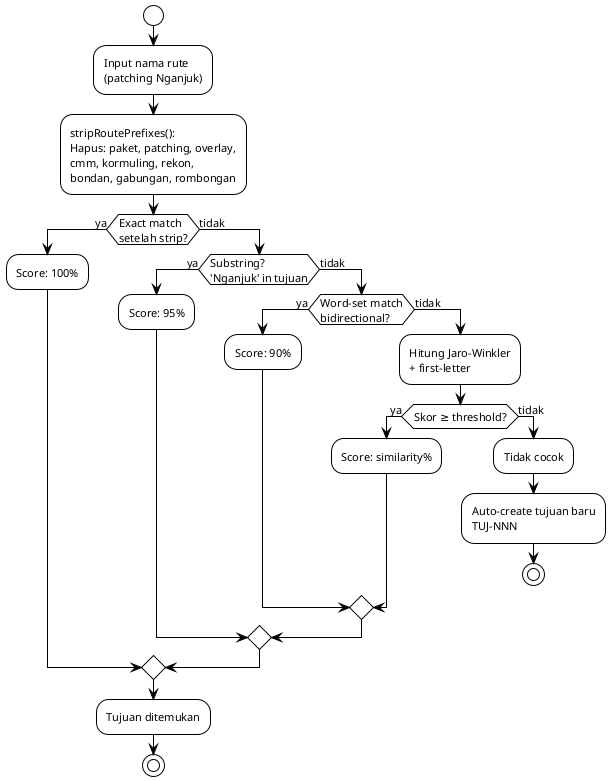

### 8.4. Alur Simpan Hasil Parse

```plantuml
@startuml
!theme plain
skinparam backgroundColor #ffffff
skinparam defaultFontSize 11
skinparam defaultFontName Arial

start
:Hasil parse: {date, packages};
:matchDrivers():\n  cocokin nama → tabel sopir\n  Exact → Metaphone → Substring → Jaro-Winkler;
:matchRoutes():\n  cocokin rute → tabel tujuan\n  Exact → Substring → Word-set → Jaro-Winkler;
:Preview:\n  driver_match[] + route_match[];

if (auto_create?) then (ya)
  :createRitases();
  foreach (Package in packages)
    :Cari driver match;
    if (Driver unmatched?) then (ya)
      :Auto-create sopir baru;
    endif
    :Cari route match;
    if (Route unmatched?) then (ya)
      :Auto-create tujuan baru;
    endif
    if (Status gagal_produksi?) then (ya)
      :Update ritase valid sebelumnya\njadi gagal_produksi, dt=0;
    else (tidak)
      if (is_rit_ke_2?) then (ya)
        :Create duplikat ritase\n(hari & sopir sama);
      else (tidak)
        if (is_bongkar?) then (ya)
          :Tandai bongkar,\nasosiasi ke non-bongkar;
        else (tidak)
          :Simpan ritase baru\n(status: pending, dt: dihitung);
        endif
      endif
    endif
  endforeach
  :Sync status sopir & tujuan;
  :Return {created, skipped, errors};
endif
stop

@enduml
```

---

## 9. Detail Ritase (Pivot Sopir × Tanggal)

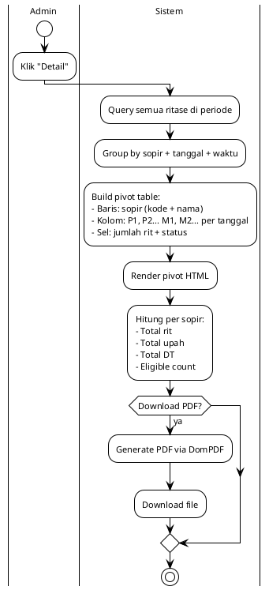

**Aturan DT:**
- Kabupaten `Nganjuk`, `Kediri`, `Kota Kediri`, `Jombang` → maks 1 DT/hari/sopir (rit ke-2 = 0)
- Kabupaten `Blitar`, `Kota Blitar`, `Ngawi`, `Kota Ngawi`, `Lainnya` → tiap rit dapat DT penuh
- Rit `gagal_produksi` → DT = 0

---

## 10. Validasi Bukti — Public Submit

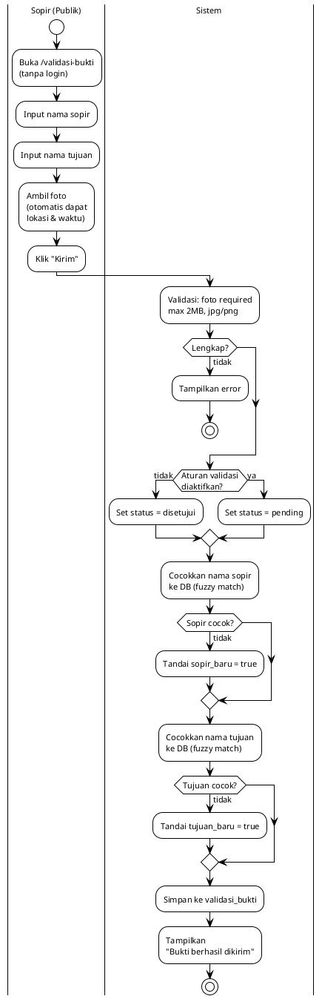

---

## 11. Validasi Bukti — Admin Review

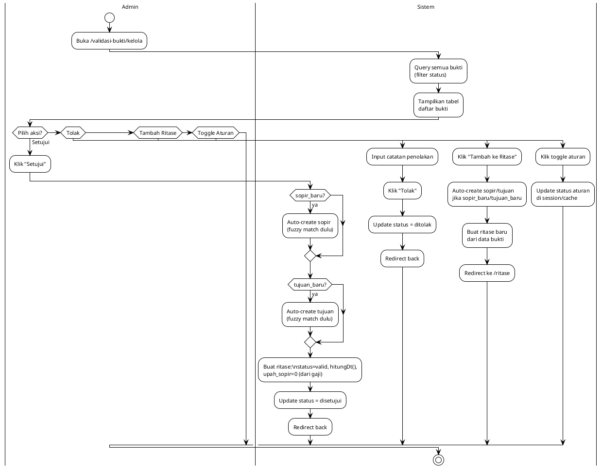

### Fungsi hitungDt()

```php
// Cek apakah sudah ada rit non-gagal dengan
// sopir + tanggal + kabupaten + waktu SAMA
$ritLain = Ritase::where(...)->first();

if ($ritLain && in_array($kabupaten,
    ['Nganjuk','Kediri','Kota Kediri','Jombang']))
{
    return 0;  // Rit ke-2 → tidak dapat DT
}
return 330000; // Dapat DT
```

---

## 12. Penggajian — Proses & Kalkulasi

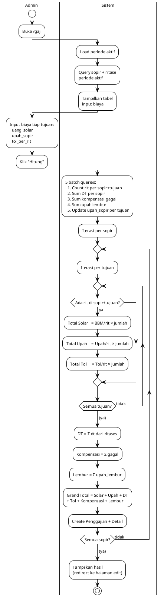

### Struktur Gaji Akhir

```
Grand Total = Total Solar + Total Upah + Total DT + Total Tol
            + Kompensasi Gagal + Upah Lembur
```

| Komponen | Sumber |
|----------|--------|
| Total Solar | Σ (BBM/rit × jumlah rit per tujuan) |
| Total Upah | Σ (upah/rit × jumlah rit per tujuan) |
| Total DT | Σ dt dari tabel ritases |
| Total Tol | Σ (tol/rit × jumlah rit per tujuan) |
| Kompensasi Gagal | Σ nominal_kompensasi dari rit gagal_produksi |
| Upah Lembur | Σ upah_lembur dari rit is_lembur=true |

---

## 13. Edit Gaji

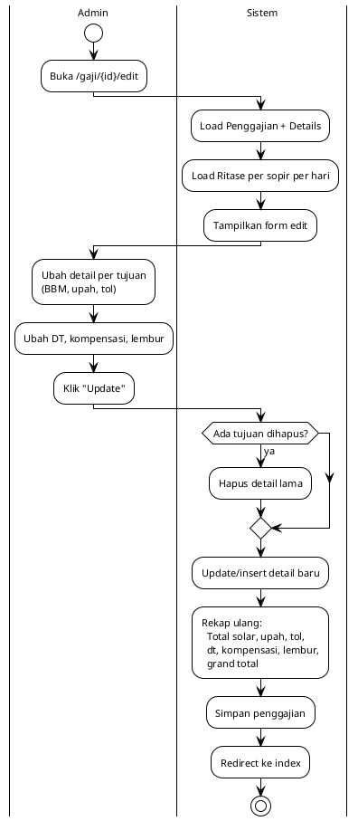

---

## 14. Slip Gaji & PDF

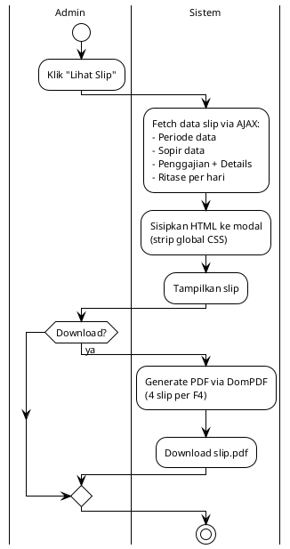

Slip per sopir: `GET /gaji/slip-pdf/{periode_id}` — download semua slip per sopir dalam 1 PDF.
Laporan rekap: `GET /gaji/laporan-pdf/{periode_id}` — rekap per sopir + per tujuan, PDF.

---

## 15. Riwayat & Laporan

```plantuml
@startuml
!theme plain
skinparam backgroundColor #ffffff
skinparam defaultFontSize 11
skinparam defaultFontName Arial

|Admin|
start
:Buka /gaji/riwayat;

|Sistem|
:Query periode (pagination);
:Tampilkan daftar periode;

|Admin|
:Klik periode → lihat rekap;

|Sistem|
:Rekap:
- Total sopir
- Hari kerja
- Total per tujuan
- Total per sopir
- Grand total;

|Admin|
if (Download PDF?) then (ya)
  |Sistem|
  :Generate PDF laporan\n(semua sopir + tujuan);
  :Download laporan.pdf;
endif
stop

@enduml
```

---

## 16. Navigasi & Struktur File

### Navigasi Utama

```plantuml
@startuml
!theme plain
skinparam backgroundColor #ffffff
skinparam defaultFontSize 11
skinparam defaultFontName Arial

[[Guest]]
start
:Buka /validasi-bukti\n(public form);
stop

[[Guest]]
start
:Buka /login;
if (Login email) then (ya)
  :AuthController@login;
else (tidak)
  :Login Google\n(hanya email terdaftar);
endif
if (Berhasil?) then (ya)
  :Redirect ke /dashboard;
endif
stop

[[Admin]]
start
:Buka /dashboard;
if (Pilih menu?) then (Sopir)
  :/sopir;
elseif (Tujuan) then
  :/tujuan;
elseif (Periode) then
  :/periode;
elseif (Ritase) then
  :/ritase (parser)
  :/ritase/table (tabel)
  :/ritase/detail-data (pivot);
elseif (Validasi) then
  :/validasi-bukti/kelola;
elseif (Gaji) then
  :/gaji (penggajian)
  :/gaji/riwayat (laporan)
  :/gaji/slip/{periode}/{sopir} (slip);
elseif (Profil) then
  :/profil;
elseif (Logout) then
  :AuthController@logout;
endif
stop

@enduml
```

### Struktur File

```
app/
├── Http/
│   ├── Controllers/
│   │   ├── AuthController.php          # Login/logout/Google OAuth/reset password
│   │   ├── DashboardController.php     # Dashboard metrics
│   │   ├── SopirController.php         # CRUD sopir
│   │   ├── TujuanController.php        # CRUD tujuan
│   │   ├── PeriodeController.php       # CRUD periode
│   │   ├── RitaseController.php        # CRUD ritase + parser + detail pivot
│   │   ├── PenggajianController.php    # Penggajian + edit + slip + laporan
│   │   ├── ValidasiBuktiController.php # Validasi bukti public + admin
│   │   ├── ProfileController.php       # Edit profil user
│   │   └── Controller.php              # Base controller
│   ├── Middleware/
│   │   ├── CacheControl.php
│   │   ├── RoleMiddleware.php
│   │   └── SecurityHeaders.php
│   ├── Requests/                       # Form request validation
├── Models/
│   ├── Sopir.php                       # Sopir model
│   ├── Tujuan.php                      # Tujuan model
│   ├── Periode.php                     # Periode model
│   ├── Ritase.php                      # Ritase model
│   ├── Penggajian.php                  # Penggajian model
│   ├── PenggajianDetail.php            # Detail per tujuan
│   ├── ValidasiBukti.php               # Validasi bukti model
│   ├── User.php                        # User auth model
│   └── Otp.php                         # OTP model
├── Services/                           # 13 service classes
│   ├── AuthService.php                 # Login, OTP, password reset
│   ├── DashboardService.php            # Dashboard metrics (cached 5 min)
│   ├── PenggajianService.php           # Generate penggajian
│   ├── PenggajianDataService.php       # Query & data penggajian
│   ├── RitaseService.php               # CRUD ritase + pivot detail
│   ├── RitaseDetailService.php         # Detail logic ritase
│   ├── RitaseParserService.php         # Facade delegasi ke 3 parser services
│   ├── RitaseTextParser.php            # Regex parsing teks WhatsApp
│   ├── RitaseFuzzyMatcher.php          # Jaro-Winkler + Metaphone matching
│   ├── RitaseCreator.php              # Insert ritase ke database
│   ├── SlipBuilderService.php          # Build data slip gaji
│   ├── LaporanBuilderService.php       # Build data laporan
│   └── ValidasiBuktiService.php        # Submit & review validasi bukti
├── Mail/
│   └── OtpMail.php                     # Email OTP
├── Traits/
│   └── HasUniqueKode.php              # Trait untuk kode unik otomatis
└── View/Components/
    └── layouts/Auth.php
resources/views/
├── auth/                               # Login, forgot/reset password, verify OTP
├── dashboard/                          # Dashboard
├── sopir/                              # CRUD sopir
├── tujuan/                             # CRUD tujuan
├── periode/                            # CRUD periode
├── ritase/                             # parser, parser-result, index, detail-html, detail-pdf
├── penggajian/                         # index, edit, slip, slip-pdf, laporan, laporan-pdf, riwayat, pdf
├── validasi-bukti/                     # form public, kelola (admin), detail
├── profil/                             # Edit profil
└── layouts/ + components/layouts/      # Layouts
routes/
└── web.php                             # Semua route
docs/
├── activity-diagram-*.puml            # Activity diagrams (PlantUML)
└── erd.puml                            # Entity relationship diagram
```

---

## 17. Iterasi Pengembangan

### Iterasi 1 — CRUD Dasar
- Sopir, Tujuan, Periode (CRUD manual via modal)
- Ritase (input manual via form)
- Penggajian (hitung manual)
- Login email/password + Google OAuth

### Iterasi 2 — Parser Teks & Fuzzy Matching
- **RitaseParserService**: input teks WhatsApp → parse otomatis
- Regex untuk ekstraksi sopir (`^\d+\.`), **bukan NER**/AI
- Fuzzy matching: Metaphone + Jaro-Winkler untuk cocokin driver & route
- Auto-create sopir/tujuan baru jika tidak cocok
- Deteksi `gagal produksi`, `bongkar`, `Rit ke 2`

### Iterasi 3 — Validasi Bukti & Geolokasi
- Public form submit: foto + geolokasi + nama sopir/tujuan
- Admin review: setujui/tolak + auto-create sopir/tujuan
- Aturan validasi (toggle on/off di session)
- Hitung DT otomatis berdasarkan aturan kabupaten

### Iterasi 4 — Detail Ritase (Pivot) & PDF
- Tabel pivot sopir × tanggal (P1/P2... M1/M2...)
- PDF detail ritase per periode
- Perbaikan aturan DT: kabupaten `Lainnya` dapat DT tiap rit
- Index optimization (15 indexes ke tabel)

### Iterasi 5 — Tol, Lembur, & Revisi Kabupaten
- Tambah kolom `tol` di penggajian + `tol_per_rit` di detail
- Tambah `is_lembur` + `upah_lembur` di ritase
- Tambah `upah_lembur` di penggajian
- Update enum kabupaten: +Blitar, Kota Blitar, Ngawi, Kota Ngawi

### Iterasi Final — Stabilisasi
- **Fix plimping**: dari keyword jenis kerja → nama daerah (dihapus dari routeKeywords & stripPrefixes)
- Tambah `kormuling`, `rekon` sebagai jenis pekerjaan
- Konsistensi strip prefix di semua titik (parser + controller)
- Auto-sync status: sopir, tujuan, periode (by tanggal)
- Dashboard dengan filter waktu & psikologi (progress %)
